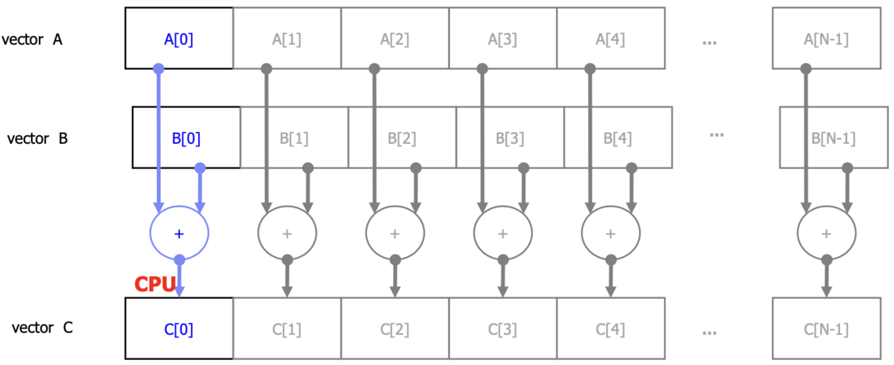

# III - Data Parallelism and CUDA C

For a CUDA programmer, a computing system consists of:
- a _host_ that is a traditional CPU, like an Intel X86, or ARM
- one or more _devices_ that are processors with massive amount of arithmetic units. A CUDA device is an NVIDIA GPU.

## Data Parallelism
By _data parallelism_ we refer to scenarios were the data exhibits characteristics that allows us to process it in parallel threads. A **_thread_** is unit of execution in the processor, and it consists of:
- the code that is being executed
- the particular point in the code being executed (current instruction)
- the values of the variables and data structures that are present.

Threads execute instructions sequentially. If a program is executed in parallel, it needs multiple threads to process different parts of the data independently.

The following image illustrates how vector addition exhibits data parallelism. In this case, we would need $N$ threads to process each sum $C[i] = A[i] + B[i]$ in parallel.

## Summary
The chapter provided a quick overview of the CUDA programming model. CUDA extends the C language to support parallel computing.

### Function declarations
CUDA extends the C function declaration syntax to support heterogeneous parallel computing. The following keywords can be used for function declarations.

`__global__` -> indicate compiler to generate kernel function.

`__device__` -> indicate compiler to generate device function.

`__host__` -> indicate compiler to generate host function.

Functions without any CUDA extension keywords will be host functions by default.

### Kernel launch
CUDA extends the C function call syntax with kernel execution configuration parameters. These exeecution configuration parameters are only used during a call to a kernel function or a kernel launch. We saw:
- grid dimensions parameter -> amount of blocks to use for execution.
- block dimensions parameter -> amount of threads in each block.

### Predefined variables
CUDA kernels can access a set of predefined variables that allow each thread to distinguish among themselves and to determine the area of data each thread is to work on.
- `threadIdx` -> 3D coordinates of the thread of execution.
- `blockIdx` -> 3D coordinates of the block of execution.
- `blockDim` -> represents the number of threads in the block.

### Runtime API

CUDA supports a set of API functions to provide services to CUDA programs. Some of them are:
- `cudaMalloc()` -> allocates data for a variable on a CUDA device.
- `cudaFree()` -> deallocates data for a variable on a CUDA device.
- `cudaMemcpy()` -> copies data from host to device or viceversa.
