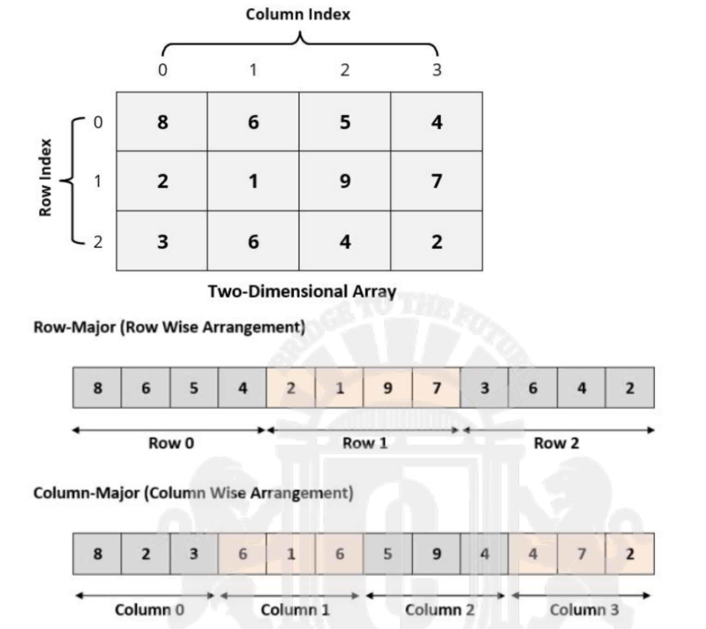

# IV - Data-parallel Execution Model

## CUDA Thread Organization
All CUDA threads in a grid execute the same kernel function and they rely on coordinates to distinguish themselves from each other and to identify the appropiate portion of the data to process.

Threads are organized in a two-level hierarchy:  grids that consist in one or more blocks, and each block consisting in one or more threads.

Blocks and threads are identified by indexes, which can be accessed via the following built-in variables:
- `blockIdx.x` returns the `x` coordinate of the block index.
- `threadIdx.x` returns the `x` coordinate of the thread index.


In general, a grid is a 3D array of blocks, and each block is a 3D array of threads. So in essence, either a block or a thread can be located by a $(x,y,z)$ tuple.

Just like the indexes, the grid dimensions and block dimensions can be accessed via `gridDim` and `blockDim` respectively.

## Handling multidimensional data
The choice of 1D, 2D, or 3D thread organizations are usually based on the nature of the data. For instance, grayscale images are 2D arrays of pixels, so it is often convenient to use a 2D grid of 2D blocks to process the pixels.

We can launch a 2D kernel by using `dimGrid` and `dimBlock`. These helpers allows us to specify the kernel execution configuration in a more general way.
- `dim3 dimBlock(x, y, z)` specifies the dimensions of a block. That is, the number of threads on the block in each axis $x, y$ and $z$.
- `dim3 dimGrid(x, y, z)` specifies the dimensions of the grid. That is, the number of **blocks** in each axis $x, y$ and $z$.

### Matrix linearization
When dealing with dynamically stored arrays, the C compiler does not know before hand the number of items that the array will store, and this is by design. Thus, the number of columns in a dynamically allocated 2D array is not known at compile time.

As a result, programmers need to explicitly **linearize** (flatten) a dynamically allocated matrix into an equivalent 1D array.



Let $M$ be a $m \times n$ matrix, where $M_{j,i}$ represents the element at row $j$ and column $i$.

### Row-major layout access formula

$$

M_{j,i} = M[j * n + i]

$$

### Column-major access formula

$$

M_{j,i} = M[i * m + j]

$$

In reality, both static and dynamic arrays in C are linearized. Static multidimensional arrays gets to use the bracket syntax because the dimensional information is given at compile time, and under the hood the compiler linearizes it into 1D equivalent.

### CUDA pattern to cover 2D array
We introduce the following pattern of using global index values to ensure that every valid data element in a 2D aray is covered by a unique thread:
```
Row = blockIdx.y * blockDim.y + threadIdx.y
```
and
```
Col = blockIdx.x * blockDim.x + threadIdx.x
```
## Synchronization
CUDA provides means to synchronize the execution of threads that belong to the same block.

### Barrier synchronization
A barrier for a group of threads in the source code means any thread must stop at this point and cannot proceed until all other threads/processes reach this barrier.

In CUDA, the `__syncthreads()` statement acts as such barrier.
- When `__syncthreads()` is present, it must be executed by all threads in a block.
- When a `__syncthreads()` statement is placed in an `if` statement, either all threads in a block execute the path that includes `__syncthreads()` or none of them does.
- For an `if-else` statement, if each path has a `__syncthreads()` statement, either all threads execute the `__syncthreads()` on the `if` path or all of them execute the `else` path. **These are two different barrier synchronization points**.

It is a responsability of the programmers to write their code so thata these requirements are satisfied.


