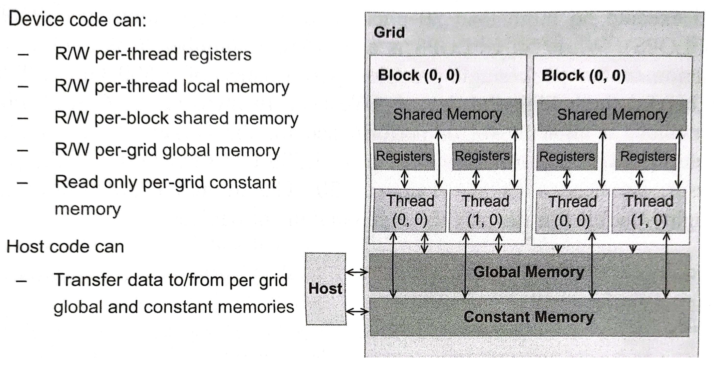

# V - CUDA Memories
Some of the performance issues arise from the fact that global memory, which is typically implemented as DRAM, tends to have long access latencies and finite access bandwidth.

CUDA provides a number of additional methods for accessing memory that can remove the majority of data requests to the global memory, which can significantly boost the exectution efficiency of CUDA kernels.

## Importance of memory access efficiency
Recall matrix multiplication kernel. To perform the inner product of the $i$ th row of matrix $M$ with the $j$ column of matrix $N$, we needed to perform a `for` loop.
```c
for (int k = 0; k < width; k++) {
  Pvalue += d_M[Row * width + k] * d_N[k * width + Col];
}
```
In every iteration of this loop there are two global memory accesses are performed for one floating-point multiplication and one floating-point addition. Thus, the _compute to global memory access ratio_ (CGMA) is 1:1 in this case.

CGMA has major implications on the performance of a CUDA kernel. Consider a device with global memory bandwidth of 200GB/s. With 4 bytes in each single-precision floating-point value, one can expect to load up to 200 / 4 = 50 giga single-precision operands per second. With a CGMA ratio of 1.0, the matrix multiplication kernel will execute up to 50 GFLOPS, which is only a tiny fraction of the peak single-precision performance of 1500 GFLOPS.

## CUDA device memory types


### Global memory
It's the DRAM of the device. To execute a kernel on a device, the programmer first needs to allocate global memory on the device and transfer the pertinent data from the host memory to global memory.

### Constant memory
Constant memory supports short-latency, high-bandwidth, read-only access by the device when all threads simultaneously access the same location.

### Registers and Shared memory
Registers and shared memory are on-chip memories. Variables stored here can be accessed at very high speed in a highly parallel manner. Registers are allocated to individual threads and holds its private data.

Shared memory is allocated to thread blocks, so all threads in a block can access variables in the shared memory locations allocated for the block. It's an efficient mean for threads to cooperate by sharing their input data and the intermediate results of their progress.


