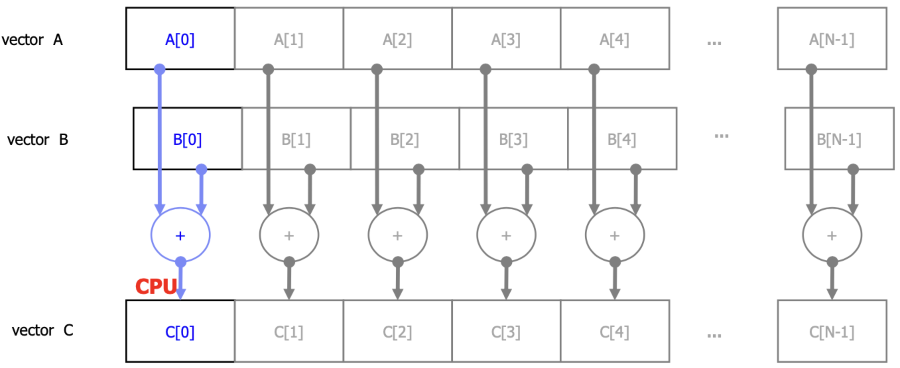
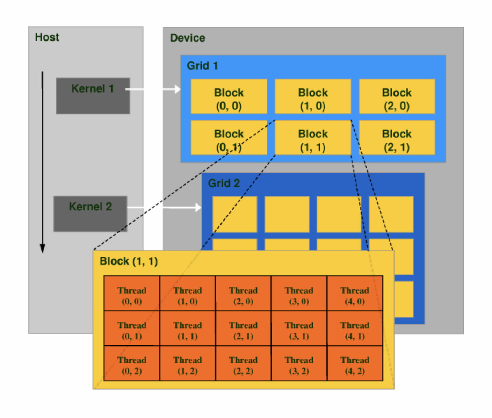

# Summary up to Chapter V

## Motivation
Improvements in CPUs started to decelerate from 2003 onwards. The increases in clock frequency to improve perfomance no longer justified the power consumption and overheating that it generated.

The intrinsic parallelism of the GPU architecture that differentiated them from the conventional CPU allowed to continue application performance improvements.


*CPUs and GPUs have fundamentally different architectures.*

CPU architectures are _latency-oriented_. They are designed to minimize the execution time of a single thread.

On the other hand, GPU architectures are _throughput-oriented_, meaning that their design strives to maximize the total execution throughput of a massively large number of threads while allowing individual threads to take a potetially much longer time to execute.

Given the difference on their designs, CPUs and GPUs perform differently depending on the use case. Generally, CPUs will not perform well on tasks on which GPUs perform well, and vice versa. However, there could be cases where **an application might benefit from both sequential and parallel execution of code**.

## Introduction to CUDA
CUDA (_Compute Unified Device Architecture_) is a programming model introduced by NVIDIA in 2007 that is designed to support joint CPU-GPU execution of code. It leverages the parallel compute engine in NVIDIA GPUs to solve complex computational problems in a more efficient way than on a CPU.

CUDA empowers **heterogeneous computing**. In a single application, a developer can write both sequential code that is executed in a _host_ (CPU) and parallel code that is executed in a _device_ (NVIDIA GPU).

### CUDA C/C++
CUDA C is a superset of the C language. CUDA C also supports a growing set of C++, which is why it's also referred as CUDA C/C++.

CUDA programs are compiled using _NVIDIA C Compiler_ (NVCC).

### CUDA Exploits Data Parallelism
Many modern software applications have sections that exhibit a rich amount of **_data parallelism_**, a phenomenon that allows arithmetic operations to be safely performed on different parts of a data structure in parallel. CUDA devices accelerate the execution of these applications by utilizing their massive number of arithmetic units to these data-parallel sections.


*Vector addition exhibits data parallelism. Each sum $A[i] + C[i]$ can be safely performed in parallel.*

CUDA C source files are a mixture of host code ande device code. Host code is plain C/C++ code, compiled with the host's standard C/C++ compiler and run as traditional CPU process. **Device code** is marked with CUDA keywords `__global__` and `__device__` to differentiate data-parallel functions.

A **host** function is a traditional C function, optionally marked with `__host__` label. Host functions are compiled and run on a CPU process. Host functions cannot be called from device code.

A **_kernel_** is a function marked with `__global__` keyword. Kernels act as the entrypoint from host functions to perform computations in the GPU.

A **device function** is a function marked with `__device__` keyword, and can be called from kernels or other device functions, but not from host functions.

## CUDA Threads

### Thread organization
In CUDA, a kernel function specifies code to be executed by all threads during a parallel phase. When the host code launches a kernel, the CUDA runtime system generates a **grid** of threads that are organized in a two-level hierarchy. A grid consists of **blocks**, all of the same size.


*Example: kernel 1 will be launched using a grid of 3 by 2 blocks, each of 5 by 3 threads.*

Grids and blocks can have up to 3 dimensions. Dimensions are specified in the *kernel execution configuration* using CUDA `dim3` structs.
```c
// kernel 1 execution configuration
dim3 dimBlock(5, 3);
dim3 dimGrid(3, 2);
kernel1<<<dimGrid, dimBlock>>>();
```

### Threads to data mapping
The configurable thread organization is essentially what enables CUDA to exploit data parallelism in order to boost performance. By mapping threads to different parts of the data—i.e. in memory values—, each part can be processed in parallel by the corresponding thread(s).

Kernel functions are executed by all threads in the specified grid. One can access the coordinates of the "current" thread using `threadIdx.{x,y,z}` as well as the "current" block using `blockIdx.{x,y,z}`. Each thread coordinate can be identified by the combination
```c
blockIdx.t * blockDim.t + threadIdx.t; // t in {x,y,z}
```
In essence, CUDA thread organization allows us to programatically map these thread identifiers to memory locations where the data that we want to process is stored, enabling threads to perform parallel data access.

Even though parallel data access brings significant performance boosts, some times memory bottlenecks arise due to poor management of the different memory types in the device, especially when dealing with a massively large number of threads.

## CUDA Memories

## Advanced Topics
### Barrier Synchronization

### Thread Scheduling in Hardware

